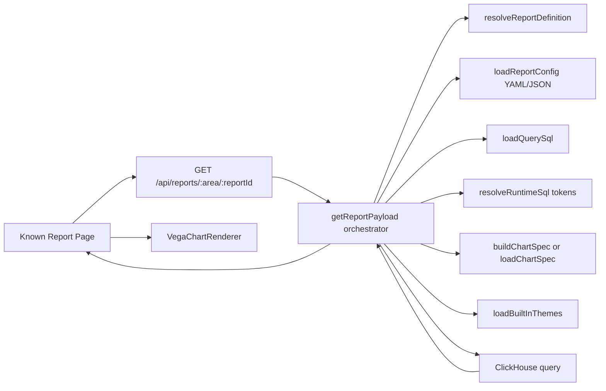

# TaxisBI Harvest Notes for Work Implementation (React + Vega + ClickHouse)

Date: 2026-07-16
Repo sweep target: main branch (full codebase)

## 1) Executive Snapshot

This codebase is now a real implementation, not just scaffolding.

What is implemented and production-useful:
- Metadata-driven chart runtime in Express/TypeScript.
- Rulebook artifact loading from disk (YAML + SQL + Vega JSON).
- Contract checks for runtime metadata, query params, tokens, and theme payloads.
- Dynamic SQL token replacement for AR aging bucket logic.
- ClickHouse query execution path with parameter binding.
- React report page with heavy hook orchestration and bucket editor UX.
- Multi-scope theme system (global/domain/rulebook/dashboard) with inheritance.
- Theme builder workflow and save endpoint.

Primary reusable value for your job:
- This is a transferable model for a governed Power BI replacement program where page layouts and report intent are already known.

### 1.1 9-5 Reframing (Power BI Replacement)

For your implementation context, treat this repo as a pattern library, not a strict folder blueprint.

Recommended framing:
- Start from known Power BI pages/reports and preserve their business intent.
- Use fixed page layouts (no free-form report builder UX).
- Keep a governed query contract per report page.
- Organize report inventory under two functional areas first:
  - JE (Journal Entry)
  - Deposits

Note:
- "domain/rulebook" terms in this document are implementation labels from this repo; in your 9-5, you can map these to "functional area/report definition" without changing the core governance pattern.

## 2) End-to-End Architecture Map



Core runtime flow:
1. Route validates path params.
2. Runtime resolves report definition assets deterministically.
3. Report config defines query contract, allowed params, and visualization metadata.
4. SQL template tokens are replaced with validated bucket expressions.
5. Query runs in ClickHouse with `query_params`.
6. API returns `spec`, `data`, `parameters`, `runtime`, `themes`, `defaultTheme`.
7. UI applies selected theme, merges spec overrides, renders with Vega.

## 3) Backend Mechanics Harvest

9-5 interpretation tip:
- Wherever this section says "rulebook", read it as "report definition".
- Wherever this section says "domain", read it as "functional area" (JE or Deposits).

### 3.1 API surface and boundaries

Implemented API routes:
- `GET /health`
- `GET /api/charts/:domain/:rulebook/:chart`
- `GET /api/themes`
- `POST /api/themes`

Route error shaping:
- 404 for missing chart/rulebook artifacts.
- 422 for chart contract validation errors.
- 500 for runtime/query failures.

Reusable pattern:
- Keep route thin and push complexity into deterministic orchestration modules.

### 3.2 Artifact discovery and safe path resolution

`resolveRulebookPaths` enforces:
- segment regex safety (`[a-z0-9_-]`)
- case-insensitive directory resolution
- stable artifact conventions

Resolved file conventions:
- `domains/{domain}/rulebooks/{rulebook}/rulebook.yaml`
- `domains/{domain}/rulebooks/{rulebook}/queries/{chart}.sql`
- `domains/{domain}/rulebooks/{rulebook}/charts/{chart}.vl.json`

Why this matters:
- You get governed discoverability without adding a custom endpoint per report.
- For your 9-5, this maps cleanly to known report inventory under JE and Deposits.

### 3.3 YAML-driven chart contract and metadata

`loadRulebookChartConfig` loads `rulebook.yaml` and extracts:
- chart builder type/config (`categorical_bar`, `time_series_line`, `kpi_card`)
- `parameters` (types, UI controls, defaults)
- `allowedQueryParams`
- `runtime` contract (query param names, SQL tokens, controls, chart runtime fields)

This turns metadata into runtime behavior and UI behavior.

### 3.4 Contract validation depth (major strength)

`getChartPayload` validates required contract pieces before query execution:
- `runtime.queryParams.reportDate` and `runtime.queryParams.buckets`
- `runtime.sqlTokens.agingBucketExpr`, `agingBucketOrderExpr`, `agingBucketDimRows`
- `runtime.chartRuntime` required fields (category/value/hover/formatting/tooltip/unit labels)
- `runtime.controls.bucketEditor` label contracts
- `parameters.report_date`, `parameters.buckets.default`
- `allowedQueryParams` includes `report_date` and `buckets`
- themes payload includes required UI and tooltip token structure

Result:
- Contract failures fail fast with explicit errors, not silent chart corruption.

### 3.5 SQL token mechanics for lean report logic

The AR aging query template uses three placeholders:
- `{{AGING_BUCKET_EXPR}}`
- `{{AGING_BUCKET_ORDER_EXPR}}`
- `{{AGING_BUCKET_DIM_ROWS}}`

Runtime process:
1. Parse `buckets` from query param JSON if present.
2. Else fallback to `parameters.buckets.default` in rulebook YAML.
3. Validate constraints:
- max 30 buckets
- each bucket name required, max 64 chars
- each bucket has 1-2 conditions
- allowed operators: `=`, `<>`, `>=`, `<=`, `>`, `<`
- values must be integers
- `OR` combinator only allowed if bucket is marked special
4. Build expression strings with `multiIf(...)`.
5. Replace tokens and drop `buckets` from `query_params` sent to ClickHouse.

Key practical design detail:
- `AGING_BUCKET_DIM_ROWS` creates a complete bucket dimension table so zero-balance buckets still render.

### 3.6 Query execution and spec selection

Chart rendering path supports two modes:
- build spec from typed builder (`type` in YAML)
- load Vega-Lite JSON spec directly from disk

Then ClickHouse execution:
- `format: JSONEachRow`
- `query_params` populated from normalized request params

Returned payload is deterministic:
- `spec`, `data`, `parameters`, `runtime`, `themes`, `defaultTheme`

### 3.7 Theme runtime and inheritance

Theme loader behavior:
- recursively scan theme JSON files
- parse and hydrate by key
- resolve `extends` chain with deep merge for `ui` and `spec`
- apply `appliesTo` context filtering (domain/rulebook/chart/dashboard)

Theme scopes:
- `1_global`
- `2_domain/{DOMAIN}`
- `3_rulebook/{DOMAIN}/{rulebook}`
- `4_dashboard/{dashboard}`

Theme save API (`POST /api/themes`) includes:
- key/label/scope validation
- context-safe path building
- duplicate key check per scope path
- writes normalized JSON theme artifact

## 4) Rulebook Artifact Harvest

### 4.1 AR rulebook metadata carries both logic and UX contracts

`domains/AR/rulebooks/Receivable_item/rulebook.yaml` contains:
- chart builder type and fields
- query param mapping
- token mapping
- bucket editor labels
- operator/combinator option lists
- canvas size option list
- chart runtime field mapping and number formatting labels

This is important for portability: UI behavior and SQL behavior are contract-coupled in one artifact.

### 4.2 SQL pattern worth copying

`domains/AR/rulebooks/Receivable_item/queries/aging_by_bucket.sql` includes:
- date parameter binding `{report_date:Date}`
- computed `days_past_due`
- tokenized aging bucket expression/order
- generated bucket dimension rows
- left join for full bucket coverage

This is a clean template for governed dynamic SQL.

### 4.3 Data setup and grain clarity

`schema.sql` explicitly sets grain to one receivable document line item.
`seed.sql` generates 50,001 synthetic documents with realistic spread and line expansion.
`testing/*.sql` provide simple sanity setup scripts for quick DB verification.

Porting insight:
- preserve explicit grain comments and deterministic order keys in schema.

## 5) UI and Report Runtime Harvest

### 5.1 App routing shape

UI uses route-level pages for report and theme builder:
- landing page
- AR aging bucket page
- theme builder page

Pattern to copy:
- explicit route-per-report keeps report contracts and UX bounded.

### 5.2 AR page hook orchestration model

`ARAgingBucketPage` composes specialized hooks for separate concerns:
- UI shell state
- bucket editor state
- contract/metadata resolution
- rulebook sync and sanitization
- chart render composition
- presentation formatting
- dismiss layer behavior

This hook split is one of the strongest transferable patterns in this repo.

### 5.3 Metadata-driven UI constraints

`useAgingBucketChartContracts` and `agingBucketPageUtils` pull runtime controls from backend metadata:
- operator options
- combinator options
- bucket editor labels
- name suggestion labels
- control visibility flags
- canvas size options

This avoids hardcoded UI behavior and aligns controls with backend contract.

### 5.4 Bucket state persistence and sync

Behavior:
- local storage key: `taxisbi.ui.agingBuckets`
- stored buckets restore on page load
- metadata defaults apply when no stored buckets
- sync hook sanitizes stored values to allowed operators/combinators

Why useful:
- users keep custom report logic while still respecting current contract constraints.

### 5.5 Chart fetch and runtime rebinding

`ARAgingBucketChart` fetches chart payload and handles runtime query param aliasing:
- first request uses `report_date` and `buckets`
- if runtime contract remaps param names, it issues a second request with mapped names

Then it validates runtime/theming contracts client-side and builds theme options.

### 5.6 Theme application + Vega rendering pipeline

Theme pipeline:
1. API returns full theme map.
2. `applyThemeToChart` coerces theme tokens to strongly typed chart UI contract with defaults.
3. chart component merges theme `spec` overrides with base spec.
4. `VegaChartRenderer` renders with error boundary and tooltip CSS variable injection.

Renderer details worth reusing:
- embed error capture (`onError`)
- React error boundary for render-time issues
- configurable canvas sizing modes (`fit-width`, `fit-screen`, ratios, custom pixels)
- tooltip appearance controlled via CSS custom properties

## 6) Theme System Harvest

The theme model is rich and portable:
- runtime UI colors and structural tokens
- chart styling tokens (bars, lines, axes, legend)
- compact number suffixes and currency symbol
- tooltip style contract
- reusable color token families (`mono`, `multi`, `sentiment`, `status`)
- overlap palette for validation highlighting

Inheritance model:
- child theme overrides parent tokens through deep merge

Scoping model:
- precise `appliesTo` targeting across domain, rulebook, chart, dashboard

Porting payoff:
- one theme engine can support both report rendering and visual authoring UX.

## 7) Dev and Ops Mechanics to Reuse

Scripts are practical and mature for local iteration:
- `dev:start`: starts Docker services, then API/UI only if needed
- `dev:guard`: health-checks `/health` before spawning API
- `dev:stop`: kills host processes on 3000/5173 and tears down Docker

This pattern prevents duplicate dev servers and reduces local friction.

Docker setup details:
- ClickHouse with db/user/password env vars
- exposed 8123/9000
- healthcheck that verifies database exists

## 8) Concrete Patterns to Port Into Your Work Codebase

High-priority imports:
1. Generic chart endpoint by artifact path convention.
2. Safe path resolver with segment validation and case-insensitive lookup.
3. Rulebook YAML contract loader for params/runtime controls.
4. Runtime contract validator that fails with structured errors.
5. SQL token compile function with strict required token list.
6. Bucket rules validator with tight constraints.
7. Tokenized SQL dimension-row pattern to keep zero buckets visible.
8. Allowed query param filter before DB execution.
9. ClickHouse adapter isolation module.
10. Theme catalog loader with inheritance and context filtering.
11. Theme save endpoint with scope-aware file targeting.
12. Route-per-report architecture in React router.
13. Hook-per-concern orchestration for complex report pages.
14. Metadata-driven operator/combinator and label controls.
15. Local storage + metadata sync strategy for report customization.
16. Vega renderer wrapper with error boundary and embed error handling.
17. Theme-to-chart contract coercion with defaults.
18. Canvas size mode system for predictable report layouts.
19. dev guard/start/stop scripts with health and port checks.
20. Synthetic data seeding approach for realistic chart testing.

## 9) Gaps, Risks, and Inconsistencies Found

Important for planning your implementation:

1. Query timeout and hard budget enforcement is now implemented on this branch.
- Added request timeout and per-query ClickHouse settings (`max_execution_time`, `max_result_rows`, overflow throw modes).

2. YAML mechanical validation is now tightened on this branch.
- Added typo detection and stricter shape checks for chart metadata keys, parameters, and allowed query params.

3. Backend bucket runtime logic deduplication is now implemented on this branch.
- Shared parser/validator/expression compiler module now powers both generic chart payload and aging chart route.

4. UI test doc endpoint drift is now fixed on this branch.
- `docs/uitest.md` now uses parameterized route examples.

5. Theme inheritance cycle detection is now implemented on this branch.
- Theme loader validates inheritance graph for cycles before hydration.

6. Residual architectural risk: frontend still performs extensive runtime contract assertions.
- This is still acceptable for defense-in-depth, but formal type-sharing between backend and frontend would reduce duplicate contract logic over time.

## 10) Practical Implementation Blueprint For Your 9-5

### 10.0 Program framing for migration from Power BI

Use a layout-first migration strategy:
1. Inventory existing Power BI pages and visuals.
2. Define target pages with locked layout templates.
3. Define one governed query contract per visual/report panel.
4. Group implementation work into two functional areas:
  - JE
  - Deposits

Do not over-index on reproducing this repo's folder names exactly; preserve the governance mechanics, not literal naming.

### 10.1 Suggested service module layout

```text
src/
  server/
    routes/
      reports.ts
      themes.ts
    reports/
      resolveReportPaths.ts
      loadReportMetadata.ts
      validateReportContract.ts
      compileSqlTokens.ts
      executeReportQuery.ts
      mapReportPayload.ts
    adapters/
      clickhouse.ts
    theme/
      loadThemes.ts
      resolveTheme.ts
      validateThemeCatalog.ts
```

### 10.2 Suggested UI module layout

```text
ui/src/
  reports/
    ar/
      aging-bucket/
        page/
        hooks/
        components/
        utils/
  charts/
    components/VegaChartRenderer.tsx
  theme/
    applyThemeToChart.ts
    api.ts
    types.ts
```

### 10.3 Suggested contract shape to lock behavior

```ts
type ReportRuntimeContract = {
  queryParams: {
    reportDate: string;
    buckets: string;
  };
  sqlTokens: {
    agingBucketExpr: string;
    agingBucketOrderExpr: string;
    agingBucketDimRows: string;
  };
  controls: {
    reportDate: boolean;
    bucketCustomizer: boolean;
  };
};
```

## 11) Email-Ready Summary (Copy/Paste)

Subject: Harvest from TaxisBI for our React + Vega + ClickHouse report runtime

Body:

I completed a deep sweep of the TaxisBI main branch and pulled out a concrete implementation model we can reuse. The strongest pattern is a governed report runtime: chart behavior is metadata-driven from rulebook artifacts (YAML + SQL + Vega JSON), with strict runtime contract validation and deterministic query execution.

The backend flow resolves chart artifacts by path convention, loads chart metadata from YAML, validates required runtime/query/theme contracts, compiles SQL tokens (including dynamic aging bucket expressions), and executes parameterized ClickHouse queries. It returns a stable payload containing spec, data, metadata, and theme contracts.

The frontend uses route-per-report architecture with hook-per-concern orchestration. The AR aging page is a solid reference: metadata-driven operator/combinator controls, bucket editor validation, local storage persistence with contract-based sanitization, and themed Vega rendering through a reusable renderer wrapper.

The theme system is enterprise-usable: global/domain/rulebook/dashboard scopes, inheritance via extends, appliesTo filters, typed UI/spec token application, and a save API for new theme artifacts.

I also identified gaps to fix in our version: enforce query budgets/timeouts, add schema validation for YAML contracts, centralize duplicate bucket validation logic, and add explicit theme inheritance cycle checks.

This gives us a practical path to build a deterministic report runner for React + Vega + ClickHouse without drifting into ad hoc BI behavior.

## 12) Confidence Notes

Confidence is high because this harvest is based on concrete implemented files in main branch runtime, rulebooks, UI hooks, and theme infrastructure.

What is still intentionally not complete in this repo:
- full landing/certification/semantic pipelines are scaffolded but not implemented
- generalized plugin system for unlimited chart types is not present
- shared backend/frontend generated contract types are not yet implemented