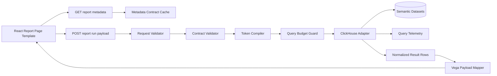

# TaxisBI to Work: Implementation Starter Pack (Detailed)

Date: 2026-07-16
Branch baseline: `docs/harvest-starter-pack`

## 1) Purpose

This document is the implementation companion to the harvest notes.

Goal:
- Give you a near turn-key blueprint for building a deterministic React + Vega + ClickHouse replacement for existing Power BI reports at work.
- Convert architecture patterns into executable scaffolding decisions.
- Include guardrails so your implementation does not drift into ad hoc BI behavior.

Working assumptions for 9-5:
- You already have known page layouts and known report outcomes from Power BI.
- Initial functional areas are:
  - JE (Journal Entry)
  - Deposits
- The implementation should prioritize stable page templates and governed report contracts over building flexible authoring tools.

## 2) What Was Fixed In This Branch Before Hand-Off

The following mechanical issues from the first harvest pass were closed directly in code/docs on this branch.

1. Query timeout and row budget enforcement added.
- Files:
  - `src/server/clickhouse/client.ts`
  - `src/server/clickhouse/querySettings.ts`
  - `src/server/rulebooks/getChartPayload.ts`
  - `src/server/routes/agingChart.ts`
- Behavior:
  - request timeout now configured at client level.
  - per-query `clickhouse_settings` now apply `max_execution_time`, `max_result_rows`, and `throw` overflow modes.

2. YAML manifest typo/shape validation tightened.
- File:
  - `src/server/rulebooks/loadRulebookChartConfig.ts`
- Behavior:
  - catches common key typos early (example: `parameteres`).
  - validates `parameters` object shape and `allowedQueryParams` shape.

3. Bucket runtime validation deduplicated on backend.
- Files:
  - `src/server/rulebooks/agingBucketRuntime.ts` (new shared module)
  - `src/server/rulebooks/getChartPayload.ts`
  - `src/server/routes/agingChart.ts`
  - `src/server/index.ts` (duplicate legacy helpers removed)
- Behavior:
  - one canonical bucket parser/validator/expression compiler for backend.

4. Theme inheritance cycle detection added at load time.
- File:
  - `src/server/routes/agingChart.ts`
- Behavior:
  - cycle in `extends` chain throws explicit error before hydration.

5. Stale endpoint docs corrected.
- File:
  - `docs/uitest.md`
- Behavior:
  - examples now reflect parameterized chart route.

6. Validation status check:
- `get_errors` returns no compile/lint problems for current workspace changes.

## 3) Non-Negotiable Product Rules For Work Port

Keep these as hard constraints:

1. Report runner, not query builder.
2. Report logic reads trusted, business-ready datasets only.
3. Runtime behavior is contract-driven and deterministic.
4. UI controls are bounded by metadata contracts.
5. SQL generation is tokenized and validated, never free-form from UI text.

## 4) Target Runtime Architecture (Implementation-Ready)



## 5) Starter Folder Blueprint

Use this structure as your first commit skeleton. Treat names as examples you can align to JE/Deposits program language.

```text
src/
  server/
    index.ts
    routes/
      reports.ts
      reportMetadata.ts
      themes.ts
    middleware/
      validateRequest.ts
      enforceQueryBudget.ts
      errorResponse.ts
    reports/
      contracts/
        arAging.contract.ts
      runtime/
        resolveReportPaths.ts
        loadReportMetadata.ts
        validateReportContract.ts
        compileSqlTokens.ts
        validateBucketRules.ts
      mappers/
        toVegaPayload.ts
    adapters/
      clickhouse.ts
      querySettings.ts
    theme/
      loadThemes.ts
      resolveThemes.ts
      validateThemeCatalog.ts
ui/
  src/
    app/
      routes.ts
      App.tsx
    reports/
      je/
        journal-entry-overview/
          page/
          hooks/
          components/
          utils/
      deposits/
        deposits-overview/
          page/
          hooks/
          components/
          utils/
    charts/
      components/VegaChartRenderer.tsx
      templates/registry.ts
    theme/
      api.ts
      applyThemeToChart.ts
      types.ts
```

## 6) API Contracts You Can Lift

9-5 naming note:
- You can model `reportId` as a stable key from your Power BI migration inventory (for example, `je_monthly_variance`, `deposits_daily_summary`).

### 6.1 Report metadata response

```ts
type ReportMetadataResponse = {
  reportId: string;
  contractVersion: number;
  parameters: Record<string, {
    type: string;
    uiControl?: string;
    required?: boolean;
    default?: unknown;
  }>;
  runtime: {
    queryParams: Record<string, string>;
    sqlTokens: Record<string, string>;
    controls: Record<string, unknown>;
    chartRuntime: Record<string, unknown>;
  };
  allowedQueryParams: string[];
};
```

### 6.2 Report run request

```ts
type ReportRunRequest = {
  reportId: 'je_monthly_variance' | 'deposits_daily_summary';
  params: {
    report_date: string;
    buckets?: string;
  };
  theme?: string;
};
```

### 6.3 Report run response

```ts
type ReportRunResponse = {
  spec: Record<string, unknown>;
  data: Array<Record<string, unknown>>;
  parameters: Record<string, unknown>;
  runtime: Record<string, unknown>;
  themes: Record<string, unknown>;
  defaultTheme: string;
};
```

## 7) Backend Guardrail Checklist (Must Implement)

1. Path safety guard
- only allow `[a-z0-9_-]` path segments.

2. Manifest shape guard
- validate chart metadata object shape.
- reject common typo keys with explicit messages.

3. Query param allow-list guard
- drop unknown params before query execution.

4. Token completeness guard
- fail if required token names missing.
- fail if expected placeholders unresolved.

5. Bucket payload guard
- max bucket count and condition count.
- integer values only.
- combinator and operator whitelist.

6. Query budget guard
- max execution time.
- max result rows.
- overflow mode throws.

7. Theme guard
- validate required token objects and data types.
- validate inheritance acyclic graph.

8. Error shaping guard
- return consistent error codes for 404/422/500 paths.

## 8) SQL Token Compiler Pattern

For report SQL templates with dynamic dimensions:

1. Read SQL template from rulebook artifact.
2. Read token names from metadata `runtime.sqlTokens`.
3. Compile runtime expressions from validated params.
4. Replace placeholders with deterministic expressions.
5. Ensure no unresolved placeholders remain.

Rule:
- Never allow unknown token names from request payload.

## 9) React Report Hook Pattern

Use this separation model:

1. `useReportUiState`
- route-level state, date/theme selector, modal toggles.

2. `useReportContracts`
- pulls metadata and resolves control contracts.

3. `useRulebookSync`
- reconciles local persisted user state with live contract restrictions.

4. `useEditorState`
- draft-state orchestration for local editing workflows.

5. `useEditorActions`
- mutation commands only (add/reorder/delete/validate/apply).

6. `useReportRender`
- API payload fetch and render adapter composition.

7. `usePresentation`
- labels, formatting, option display text.

This keeps big pages testable and maintainable.

For your migration program:
- Reuse the same hook structure across JE and Deposits pages so each migrated Power BI page has a predictable implementation pattern.

## 10) Vega Runtime Pattern

Recommended behavior:

1. Keep base report spec in rulebook artifact.
2. Apply theme `spec` overrides with deep merge.
3. Inject data only after contract validation.
4. Render via wrapper component with:
- error boundary
- embed error handling
- tooltip CSS variable controls
- deterministic canvas size modes

Avoid:
- ad hoc per-page Vega rendering logic.

## 11) Theme System Porting Pattern

### 11.1 Scope model

1. global
2. domain
3. rulebook
4. dashboard

### 11.2 Resolution model

1. load all theme artifacts
2. validate shape and keys
3. validate no `extends` cycles
4. resolve inheritance
5. filter by context via `appliesTo`
6. return sorted options + default selection

### 11.3 Authoring model

1. user creates draft in theme builder
2. API validates key/scope/context
3. API writes to scope-specific path
4. UI reloads catalog

## 12) ClickHouse Adapter Baseline

Minimum adapter policy:

1. central client module
2. central query settings module
3. request timeout set in client
4. execution timeout and result row cap per query
5. typed helper wrapper for JSONEachRow result decoding
6. telemetry event per query (`duration`, `rows`, `reportId`)

## 13) Tests You Should Add First

### 13.1 Unit

1. path segment validator rejects traversal/injection attempts
2. manifest validator catches typo keys
3. bucket validator catches invalid operators/combinators/types
4. token compiler fails unresolved token placeholders
5. theme resolver fails inheritance cycle

### 13.2 Integration

1. report route returns 404 on missing rulebook/chart
2. report route returns 422 on contract error
3. report route returns 200 with stable payload shape
4. query guard triggers on excessive rows/time

### 13.3 UI

1. metadata controls render from runtime contract
2. stored bucket state is sanitized against current allowed operators
3. theme changes update chart appearance deterministically
4. Vega renderer shows clear fallback when spec fails

## 14) Cutover Plan (2 Weeks, High Confidence)

Week 1:
1. backend scaffold + report metadata/load/validate path
2. clickhouse adapter + query guard settings
3. first JE report route with tokenized SQL compile
4. initial theme loader + resolver

Week 2:
1. React report pages for JE and Deposits + shared hook orchestration
2. bucket editor or equivalent bounded control
3. Vega render wrapper + theme application
4. contract tests + integration tests + doc hardening

## 15) Risks To Keep Watching

Still relevant after branch fixes:

1. Metadata drift across environments
- mitigation: add schema-level CI validation against all rulebook YAML.

2. Frontend/backend contract divergence
- mitigation: shared contract package or generated types.

3. Theme token sprawl
- mitigation: enforce token naming conventions and lint checks.

4. Query cost regression from future report templates
- mitigation: add telemetry thresholds and alerting.

## 16) Final Handoff Checklist

Before sending to work self:

1. Confirm branch is `docs/harvest-starter-pack`.
2. Confirm docs are updated:
- `docs/harvest-taxisbi-to-work.md`
- `docs/harvest-work-starter-pack.md`
- `docs/uitest.md`
3. Confirm no compile errors.
4. Open PR from branch to main.
5. In PR description, include:
- branch fixes made for mechanical gaps
- starter-pack document link
- suggested implementation sequence.